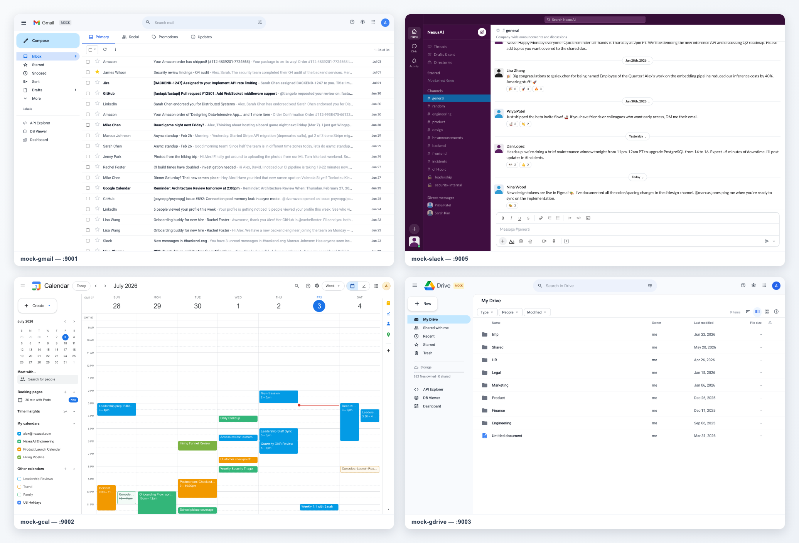

<div align="center">

# env0

**Open-source mock workspace runtime for agent evaluation and local development.**

[](https://github.com/benchflow-ai/env0/actions/workflows/ci.yml)
[](LICENSE)

</div>



env0 inherits from the mock environments in **[ClawsBench](https://github.com/benchflow-ai/ClawsBench)**,
a benchmark for evaluating and improving LLM agents in realistic productivity settings.
env0 provides local, stateful mock services for productivity-agent evalulation and training:
Gmail, Calendar, Drive, Docs, Slack, and more. The services expose REST APIs, web UIs,
OpenAPI docs, MCP servers, deterministic seeds, and evaluation control endpoints
for reset, snapshots, diffs, and action logs.

The repo is intentionally focused on environment runtime work: mock service
development, local tooling, seed contracts, API parity, example task fixtures,
and the shared Docker base image. Benchmark dashboards, canonical task authoring,
and scoring policy live in downstream benchmark packages.

## Quick Start

Prerequisites:

- Python 3.12+
- [`uv`](https://github.com/astral-sh/uv)
- Docker, only for Docker/base-image smoke checks

Start all configured services and the devhub:

```bash
scripts/dev.sh
```

Open the devhub at `http://127.0.0.1:9060`. It links to each service UI,
OpenAPI docs, admin endpoints, and dev dashboard.

Useful development entry points:

```bash
scripts/dev.sh task gdrive-archive-stale-drafts  # start only the services declared by one task
scripts/smoke_dev.sh                             # launcher/control/devhub smoke test
python3 devhub/app.py --render-once              # render devhub once without starting services
```

Stop the local stack with `Ctrl-C`. Runtime databases are written under
`.data/dev/`; remove that directory for a clean local slate.

## Example Services

Service metadata is defined in [`config.toml`](config.toml). Control scripts,
the devhub, Docker generation, and service CLIs read from that file.

| Service | Port | Environment variable | API surface | Golden fixtures |
|---|---:|---|---|---:|
| `mock-gmail` | 9001 | `MOCK_GMAIL_URL` | Gmail API v1 | 35 |
| `mock-gcal` | 9002 | `MOCK_GCAL_URL` | Calendar API v3 | 31 |
| `mock-gdrive` | 9003 | `MOCK_GDRIVE_URL` | Drive API v3 | 42 |
| `mock-gdoc` | 9004 | `MOCK_GDOC_URL` | Docs API v1 plus comments | 6 |
| `mock-slack` | 9005 | `MOCK_SLACK_URL` | Slack Web API | 57 |

The fixture counts above are tracked in the current release gate documented in
[`docs/parity-audit/AUDIT_RESULTS.md`](docs/parity-audit/AUDIT_RESULTS.md).

Every service exposes the same operational shape:

- `/` - product-style web UI over the live local state
- `/docs` - OpenAPI reference for the replicated API
- `/health` - liveness probe
- `/_admin/state` - full state dump for evaluators
- `/_admin/diff` - changes since the initial seed snapshot
- `/_admin/action_log` - ordered API actions taken by the agent
- `/_admin/snapshot/{name}` and `/_admin/restore/{name}` - named snapshots
- `/dev/*` - development dashboards, API explorers, and DB viewers
- `/mcp` - MCP tools for agent clients, when enabled by the service CLI

## Tasks

[`example_tasks/`](example_tasks/) contains runnable env0 fixtures. Each task
includes an instruction, service declaration, optional seed data, oracle solution,
Dockerfile template, and evaluator.

```text
example_tasks/gdrive-archive-stale-drafts/
|-- instruction.md
|-- task.toml
|-- environment/Dockerfile
|-- data/needles.py
|-- solution/solve.sh
`-- tests/evaluate.py
```

Tasks select services through `task.toml`:

```toml
[environment]
services = ["mock-gdrive"]
```

The public launcher UX stays task-name based:

```bash
scripts/dev.sh task gdrive-archive-stale-drafts
```

Evaluators should score the final service state, the diff from the initial
snapshot, and the action log. They should not depend on agent transcript text.

[`tasks/`](tasks/) contains additional BenchFlow-format task packages kept as a
public reference set. They are not the source of truth for benchmark policy.

## Docker Base Image

The shared base image is generated from this repo and tagged as:

```text
ghcr.io/benchflow-ai/env0:<VERSION>
```

[`VERSION`](VERSION) is the base-image semver source of truth. Thin task images
should inherit from the base image and keep hidden task payload under
`/var/lib/task`.

Docker validation commands:

```bash
docker/build-base.sh
PULL_BASE=0 scripts/smoke_docker_examples.sh
docker/build-base.sh --push
```

Run the push command only when GHCR package permissions are configured.

## Runtime Contracts

- Use `config.toml` as the single source of truth for service metadata.
- Use current `mock-*` service names and `MOCK_*_URL` environment variables.
- Select task services with `task.toml [environment] services = [...]`.
- Do not infer services from Dockerfile text.
- Keep raw `--task-data` and task-data-path plumbing internal to env CLIs,
  control scripts, and Dockerfiles.
- Do not copy env source code into task images.
- Keep hidden task data unreadable by the normal `agent` user.
- Update docs when changing seed, Docker, launcher, or devhub contracts.

## Validation

Run the checks that match the change:

```bash
scripts/smoke_dev.sh
python3 devhub/app.py --render-once
cd packages/environments/mock-gdrive && uv run --extra dev pytest tests -q
cd packages/environments/mock-gdrive && uv run --extra dev pytest tests/test_conformance.py -q
PULL_BASE=0 scripts/smoke_docker_examples.sh
```

Use the per-service pytest command for the service you changed. Docker checks are
required before and after Dockerfile or base-image changes.

## Repo Layout

```text
env0/
|-- packages/environments/   # mock-gmail, mock-gcal, mock-gdoc, mock-gdrive, mock-slack
|-- devhub/                  # local dev dashboard on port 9060
|-- docker/                  # base-image generation and gws wrapper
|-- docs/                    # guides, parity audit, validated workflows
|-- example_tasks/           # runnable env0 task fixtures
|-- tasks/                   # public BenchFlow-format reference tasks
|-- scripts/                 # dev.sh, env0_control.py, smoke tests
|-- config.toml              # service and port metadata
`-- VERSION                  # base-image version
```

## Documentation

- [Docs index](docs/README.md)
- [Local dev and devhub](docs/dev.md)
- [Adding a new environment](docs/adding-new-environment.md)
- [API validation playbook](docs/api-validation-playbook.md)
- [Parity audit](docs/parity-audit/README.md)
- [Validated workflows](docs/validated-workflows.md)
- [Good first contributions](docs/good-first-contributions.md)
- [Contributing](CONTRIBUTING.md)
- [Security policy](SECURITY.md)

## Related Repos

- [benchflow](https://github.com/benchflow-ai/benchflow) - evaluation framework,
  task standard, and agent runners.
- [ClawsBench](https://github.com/benchflow-ai/ClawsBench) - public benchmark
  built on env0 environments.

## License

env0 is licensed under the GNU Affero General Public License v3.0 only
(`AGPL-3.0-only`). See [LICENSE](LICENSE).
