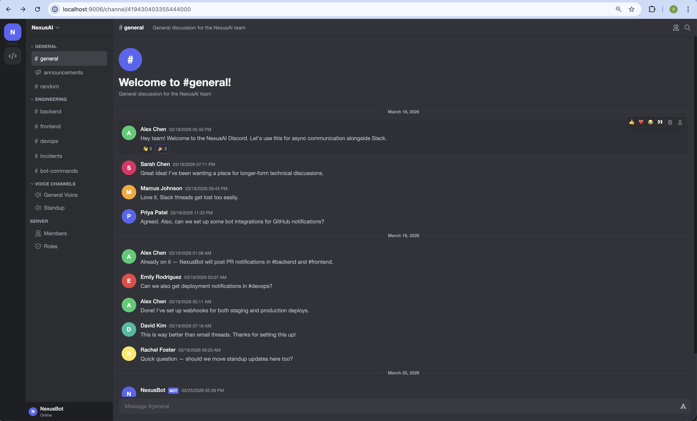

# Mock Discord

A stateful mock of the Discord Bot REST API for env0 tasks.



## What it does

- Implements Discord-style guild, channel, message, role, member, webhook, emoji, thread, invite, ban, and reaction endpoints.
- Uses deterministic Discord-style snowflake IDs for reproducible seeding.
- Stores state in SQLite and supports snapshot/restore for evaluation runs.
- Provides a browser UI plus `/docs`, `/dev/dashboard`, `/dev/db-viewer`, and `/dev/api-explorer`.
- Includes conformance fixtures and tests for Discord response shapes and error formats.

## Quick Start

```bash
cd packages/environments/mock-discord

uv run mock-discord seed
uv run mock-discord serve --no-mcp
```

The service starts on port `9006` by default:

```bash
curl -s http://localhost:9006/api/v10/users/@me
curl -s http://localhost:9006/api/v10/users/@me/guilds
```

The public env0 task runtime sets `DISCORD_URL=http://localhost:9006` for agents.

## Seed Data

The default scenario creates a fictional NexusAI Discord server with:

- 13 users, including one bot user named `NexusBot`
- 13 channels, including `#general`, `#backend`, `#frontend`, `#devops`, and `#incidents`
- 5 roles and 5 custom emojis
- 59 realistic engineering/team messages plus reaction sets

## CLI

```bash
uv run mock-discord seed
uv run mock-discord serve --no-mcp
uv run mock-discord reset
uv run mock-discord list-tasks
```

Admin endpoints used by the task harness:

```text
POST /_admin/reset
GET  /_admin/state
GET  /_admin/diff
GET  /_admin/action_log
POST /_admin/snapshot/{name}
POST /_admin/restore/{name}
```

## Testing

```bash
uv run --extra dev pytest tests -q
uv run --extra dev pytest tests/test_conformance.py -q
```

## Fixture Capture

The checked-in fixtures are static test data. Re-capturing them is optional and requires a throwaway Discord bot token and guild ID supplied from your local environment; never commit those credentials.
